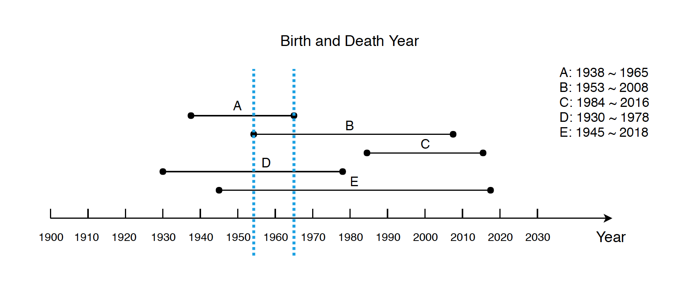
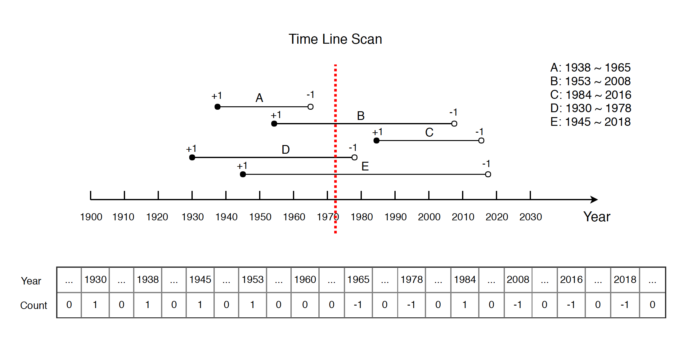
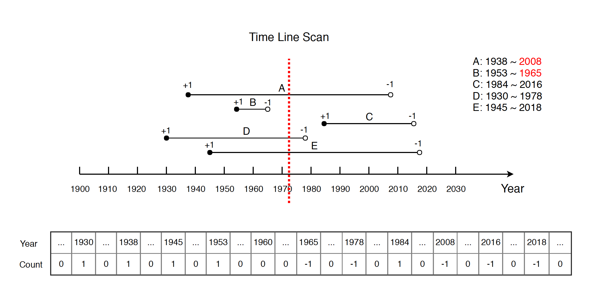

# Algorithm - Sweep Line

A sweep line is an imaginary vertical line which is swept across the plane rightwards. Use sweep line approach for solving interval problems.

## Problem - Maximum Population

### Problem Description

Given some people's birth and death year, find out the maximum population. (One similar problem is how many planes are in the air, suppose you are given with an array containing the take-off time and landing time.)

For example, we have 5 persons with their birth and death year.

* A: 1938 ~ 1965
* B: 1953 ~ 2008
* C: 1984 ~ 2016
* D: 1930 ~ 1978
* E: 1945 ~ 2018

The maximum population happens between 1953 and 1965, which is 4.
{:width="800px"}  

### Brute Force Solution

First, find the first year(birth) and the last year(death) of the given persons, create an array with the same length of the year range. Then, calculate the population for each year. Finally, find the maximum population.

Below is the implementation.

```java
// brute force,
// time: O(n*y), n is the number of persons, y is the year range.
// space: O(y)
public int getMostPopulationBruteForce(int[][] persons) {
    if (persons == null || persons.length == 0) {
        return 0;
    }

    // find the first year(birth) and the last year(death) of the given persons
    int yearStart = Integer.MAX_VALUE, yearEnd = Integer.MIN_VALUE;
    for (int[] person : persons) {
        yearStart = Math.min(yearStart, person[0]);
        yearEnd = Math.max(yearEnd, person[1]);
    }

    // calculate the population for each year
    int max = 0;
    int[] years = new int[yearEnd - yearStart + 1];
    for (int i = 0; i < years.length; i++) {
        for (int j = 0; j < persons.length; j++) {
            if ((persons[j][0] <= i + yearStart) &&
                (persons[j][1] > i + yearStart)) {
                years[i]++;
            }
        }
        max = Math.max(max, years[i]);
    }

    return max;
}
```

* Time complexity: $O(n*y)$, n is the number of persons, y is the year range.
* Space complexity: $O(y)$, y is the year range.

### Sweep Line Solution

Create a same array as discussed in the previous solution. Sweep the time line from left to right, when we meet a birth, increment the count for that year by one; when we meet a death, decrement the count for that year by one. At last, go through the array, summarize the count for all years from left to right. Meanwhile, note down the maximum count.

Notice that, when decreasing the count, we don't care who was actually dead in that year. For example, if we exchange the death year for person A and person B, our algorithm produces same array.

Below is the implementation. Notice that no sorting is required.

```java
// timeline, add 1 if born, minus 1 if dead, count the maximum of the timeline.
// time: O(n+y), n is the number of persons, y is the year range.
// space: O(y)
public int getMostPopulation(int[][] persons) {
    if (persons == null || persons.length == 0) {
        return 0;
    }

    // find the first year(birth) and the last year(death) of the given persons
    int yearStart = Integer.MAX_VALUE, yearEnd = Integer.MIN_VALUE;
    for (int[] person : persons) {
        yearStart = Math.min(yearStart, person[0]);
        yearEnd = Math.max(yearEnd, person[1]);
    }

    // increment if born, decrement if dead
    int[] years = new int[yearEnd - yearStart + 1];
    for (int i = 0; i < persons.length; i++) {
        years[persons[i][0] - yearStart]++;
        years[persons[i][1] - yearStart]--;
    }

    // go through and find the maximum
    int max = 0;
    int count = 0;
    for (int i = 0; i < years.length; i++) {
        count += years[i];
        max = Math.max(max, count);
    }

    return max; // return 4
}
```

* Time complexity: $O(n+y)$, n is the number of persons, y is the year range.
* Space complexity: $O(y)$, y is the year range.

## Problem - Car Pooling

### Problem Description

You are driving a vehicle that has `capacity` empty seats initially available for passengers.  The vehicle only drives east (ie. it cannot turn around and drive west.)

Given a list of trips, `trip[i] = [num_passengers, start_location, end_location]` contains information about the i-th trip: the number of passengers that must be picked up, and the locations to pick them up and drop them off.  The locations are given as the number of kilometers due east from your vehicle's initial location.

Return true if and only if it is possible to pick up and drop off all passengers for all the given trips.

Example 1:

```raw
Input: trips = [[2,1,5],[3,3,7]], capacity = 4
Output: false
```

Example 2:

```raw
Input: trips = [[2,1,5],[3,3,7]], capacity = 5
Output: true
```

Example 3:

```raw
Input: trips = [[2,1,5],[3,5,7]], capacity = 3
Output: true
```

Example 4:

```raw
Input: trips = [[3,2,7],[3,7,9],[8,3,9]], capacity = 11
Output: true
```

Constraints:

* trips.length <= 1000
* trips[i].length == 3
* 1 <= trips[i][0] <= 100
* 0 <= trips[i][1] < trips[i][2] <= 1000
* 1 <= capacity <= 100000

### Sweep Line Solution

Similar solution as the previous problem. Create an array to store the number of passengers for all locations.

Below is the implementation. Notice that no sorting is required.

```java
public boolean carPooling(int[][] trips, int capacity) {
    if (trips == null || trips.length == 0) {
        return true;
    }

    // find the minimum and maximum locations
    int start = Integer.MIN_VALUE, end = Integer.MAX_VALUE;
    for (int[] trip : trips) {
        start = Math.min(start, trip[1]);
        end = Math.max(end, trip[2]);
    }

    // create an array with the length of available locations
    int[] locations = new int[end - start + 1];

    // increment if pick up, decrement if drop off
    for (int i = 0; i < trips.length; i++) {
        locations[trips[i][1] - start] += trips[i][0];
        locations[trips[i][2] - start] -= trips[i][0];
    }

    // go through and count the passengers on board
    int count = 0;
    for (int i = 0; i < locations.length; i++) {
        count += locations[i];
        if (count > capacity) {
            return false;
        }
    }

    return true;
}
```

* Time complexity: $O(n+y)$, n is the number of persons, y is the year range.
* Space complexity: $O(y)$, y is the year range.

Since the value of location is restricted within 0~1000, so we can optimize the solution by directly defining the location array with length 1001.

```java
public boolean carPooling(int[][] trips, int capacity) {
    if (trips == null || trips.length == 0) {
        return true;
    }

    int[] locations = new int[1001];

    // increment if pick up, decrement if drop off
    for (int i = 0; i < trips.length; i++) {
        locations[trips[i][1]] += trips[i][0];
        locations[trips[i][2]] -= trips[i][0];
    }

    // go through and count the passengers on board
    int count = 0;
    for (int i = 0; i < locations.length; i++) {
        count += locations[i];
        if (count > capacity) {
            return false;
        }
    }

    return true;
}
```

## Classic Problems

* [LintCode 391 - Number of Airplanes in the Sky](https://www.lintcode.com/problem/number-of-airplanes-in-the-sky/)
* [LeetCode 1094 - Car Pooling](https://leetcode.com/problems/car-pooling/)
* [LeetCode 218 - The Skyline Problem](https://leetcode.com/problems/the-skyline-problem/)

## Source files

* [Source files for Sweep Line on GitHub](https://github.com/jojozhuang/dsa-java/tree/master/alg-sweep-line)
* [Sweep Line Diagrams(draw.io) in Google Drive](https://drive.google.com/file/d/1qh2nqRorRfF4H89DP94aU3SeywZvI17C/view?usp=sharing)

## References

* [Line Sweep Technique](https://www.hackerearth.com/practice/math/geometry/line-sweep-technique/tutorial/)
* [Line Segment Intersection](https://www.youtube.com/watch?v=dePDHVovJlE)
* [The Skyline Problem at LeetCode](https://leetcode.com/problems/the-skyline-problem/)
* [The skyline problem](https://briangordon.github.io/2014/08/the-skyline-problem.html)
