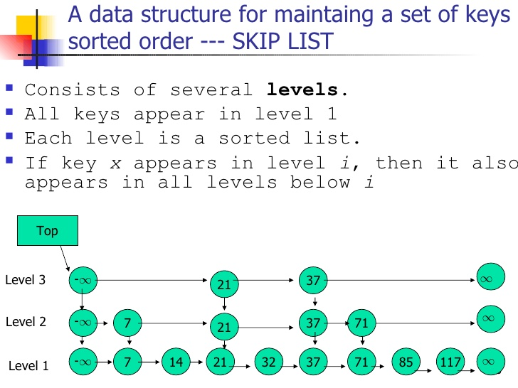
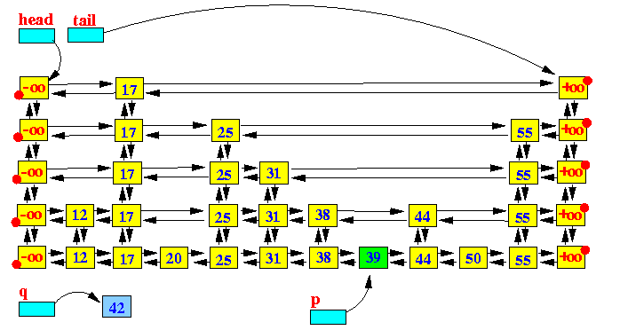
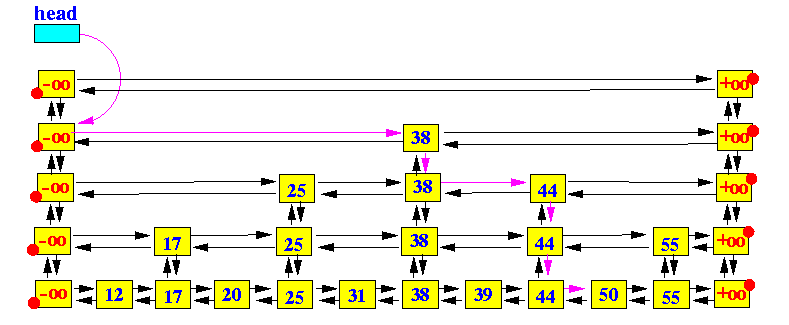
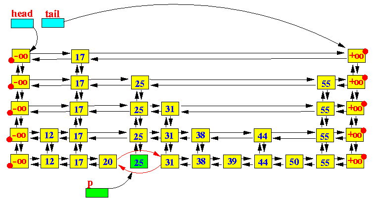

# Skip List

A skip list is a data structure that allows `log(n)` search complexity as well as `log(n)` insertion complexity within an ordered sequence of `n` elements.

## Problem of Linked List

A linked list is represented by a sequence of nodes. Each node contains a link to another node. The worst case search time for a sorted linked list is `O(n)` as we can only linearly traverse the list and cannot skip nodes while searching.

## Why Skip List?

It skips over many of the items of the full list in one step, that’s why it is known as skip list.
{:width="600px"}  

## Insert, Search and Delete

Insert 44.
{:width="800px"}
Search 44.
{:width="800px"}
Delete 25.
{:width="800px"}

## Implementation

Define skip list node.

```java
public class SkipNode {
    public int val;

    public SkipNode left;
    public SkipNode right;
    public SkipNode up;
    public SkipNode down;

    public SkipNode(int val) {
        this.val = val;
        this.left = null;
        this.right = null;
        this.up = null;
        this.down = null;
    }

    public SkipNode(SkipNode lowerLevelNode) {
        this.val = lowerLevelNode.val;
        this.left = null;
        this.right = null;
        this.up = null;
        this.down = lowerLevelNode;
    }
}
```

List.

```java
import java.util.ArrayList;
import java.util.List;

public class SkipList {
    /*
     * These are starting pointers. They are always from top layer.
     */
    private SkipNode head;
    private SkipNode tail;

    public SkipList() {
        head = new SkipNode(Integer.MIN_VALUE);
        tail = new SkipNode(Integer.MAX_VALUE);

        head.right = tail;
        tail.left = head;
    }

    public SkipNode search(int val) {
        SkipNode curr = head;

        while (curr != null) {
            while (curr.right != null && curr.right.val <= val ) {
                curr = curr.right;
            }

            if (curr.val == val) {
                break;
            }

            curr = curr.down;
        }

        return curr;
    }

    public boolean insert(int data) {
        List<SkipNode> pointersToUpdate = new ArrayList<>();

        SkipNode curr = head;
        while (curr != null) {
            while (curr.right != null && curr.right.val < data ) {
                curr = curr.right;
            }

            pointersToUpdate.add(curr);
            curr = curr.down;
        }

        // insert after this node.
        int level = 0;
        SkipNode newNode = null;

        while (level == 0 || flipCoin()) {
            // now move up.
            if (newNode == null) {
                newNode = new SkipNode(data);
            } else {
                newNode = new SkipNode(newNode);
            }

            SkipNode nodeToUpdate;

            if (pointersToUpdate.size() <= level) {
                createNewLayer();
                nodeToUpdate = this.head;
            } else {
                nodeToUpdate = pointersToUpdate.get(pointersToUpdate.size() - level - 1);
            }

            // insert
            newNode.right = nodeToUpdate.right;
            newNode.left = nodeToUpdate;

            newNode.right.left = newNode;
            nodeToUpdate.right = newNode;

            level++;
        }

        return true;
    }

    public boolean delete(int data) {
        List<SkipNode> pointersToUpdate = new ArrayList<>();

        SkipNode curr = this.head;
        while (curr != null) {
            while (curr.right != null && curr.right.val < data ) {
                curr = curr.right;
            }

            if (curr.right.val == data) {
                pointersToUpdate.add(curr);
            }

            curr = curr.down;
        }

        for (int i = 0; i < pointersToUpdate.size(); i++) {
            SkipNode nodeToUpdate = pointersToUpdate.get(i);
            SkipNode nodeToDelete = nodeToUpdate.right;

            nodeToUpdate.right = nodeToDelete.right;
            nodeToDelete.right.left = nodeToUpdate;

            nodeToDelete.up = null;
            nodeToDelete.down = null;
        }

        return true;
    }

    private void createNewLayer() {
        SkipNode newHead = new SkipNode(Integer.MIN_VALUE);
        SkipNode newTail = new SkipNode(Integer.MAX_VALUE);

        newHead.right = newTail;
        newTail.left = newHead;

        head.up = newHead;
        newHead.down = head;
        head = newHead;

        tail.up = newTail;
        newTail.down = tail;
        tail = newTail;
    }

    private boolean flipCoin() {
        return Math.random() >= 0.5;
    }

    public void print() {
        SkipNode curr = this.head;

        while (curr.down != null) {
            curr = curr.down;
        }

        curr = curr.right;

        while (curr.right != null) {
            System.out.print(curr.val + " ");
            curr = curr.right;
        }

        System.out.println();
    }

    public void printAllLevel() {
        SkipNode curr = this.head;

        while (curr != null) {
            SkipNode firstInLevel = curr;
            firstInLevel = firstInLevel.right;

            while (firstInLevel.right != null) {
                System.out.print(firstInLevel.val + " ");
                firstInLevel = firstInLevel.right;
            }

            curr = curr.down;
            System.out.println();
        }
    }
}
```

Test.

```java
public class SkipListExample {
    public static void main( String[] args ) {
        SkipList list = new SkipList();
        list.insert(5);
        list.insert(10);
        list.insert(9);
        list.insert(8);
        list.insert(12);
        list.insert(1);
        list.insert(50);
        list.insert(60);
        list.insert(70);
        list.insert(90);

        list.print();
        SkipNode node = list.search(9);
        System.out.println(node.val);
        //list.printAllLevel();

        list.delete(10);
        list.delete(1);
        list.print();
        //list.printAllLevel();
    }
}
```

Output.

```raw
1 5 8 9 10 12 50 60 70 90
9
5 8 9 12 50 60 70 90
```

## Source Files

* [Source files for Skip List on GitHub](https://github.com/jojozhuang/dsa-java/tree/master/ds-skiplist)

## Reference

* [SkipList 跳表](https://kenby.iteye.com/blog/1187303)
* [跳跃表-原理及Java实现](https://www.cnblogs.com/acfox/p/3688607.html)
* [Implementing the skip list data structure](http://www.mathcs.emory.edu/~cheung/Courses/323/Syllabus/Map/skip-list-impl.html)
* [Implements a dictionary as a SkipList](http://cs.colby.edu/courses/F13/cs231/LectureNotes/lec35/SkipList.java)
* [Java Implementation of SkipList](https://ide.geeksforgeeks.org/gy6VBW)
* [Inserting and Removing from a Skip List](https://www.youtube.com/watch?v=Q9MdwzewSZg)
