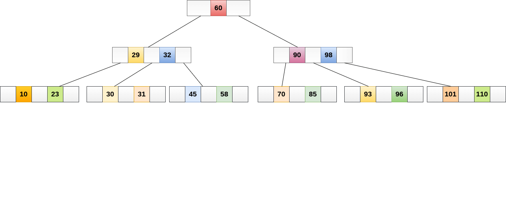
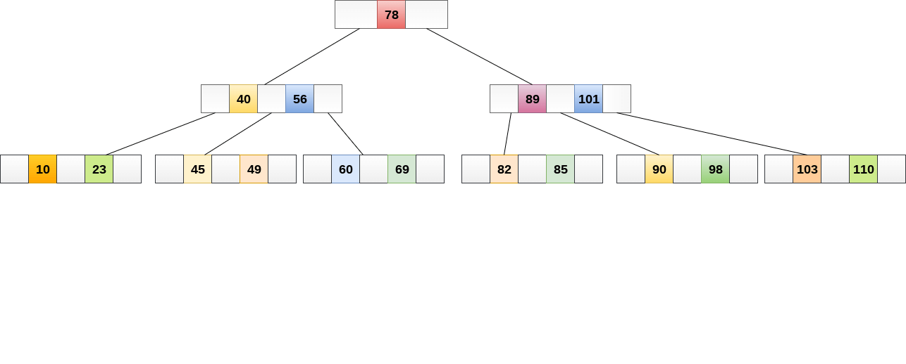

# Data Structure - B Tree

Introduce B Tree and its properties.

## What is B Tree?

`B Tree` is a specialized m-way tree that can be widely used for disk access. A B-Tree of order **m** can have at most m-1 keys and m children. One of the main reason of using B tree is its capability to store large number of keys in a single node and large key values by keeping the height of the tree relatively small.

A B tree of order m contains all the properties of an M way tree. In addition, it contains the following properties.

* Every node in a B-Tree contains at most m children.
* Every node in a B-Tree except the root node and the leaf node contain at least m/2 children.
* The root nodes must have at least 2 nodes.
* All leaf nodes must be at the same level.

It is not necessary that, all the nodes contain the same number of children but, each node must have m/2 number of nodes.



While performing some operations on B Tree, any property of B Tree may violate such as number of minimum children a node can have. To maintain the properties of B Tree, the tree may split or join.

## Application of B tree

B tree is used to index the data and provides fast access to the actual data stored on the disks since, the access to value stored in a large database that is stored on a disk is a very time consuming process.

Searching an un-indexed and unsorted database containing n key values needs O(n) running time in worst case. However, if we use B Tree to index this database, it will be searched in O(log n) time in worst case.

## B Tree Operations

### Searching

Searching in B Trees is similar to that in Binary search tree. For example, if we search for an item 49 in the following B Tree. The process will something like following :

* Compare item 49 with root node 78. since 49 < 78 hence, move to its left sub-tree.
* Since, 40<49<56, traverse right sub-tree of 40.
* 49>45, move to right. Compare 49.
* match found, return.

Searching in a B tree depends upon the height of the tree. The search algorithm takes O(log n) time to search any element in a B tree.


### Inserting

Insertions are done at the leaf node level. The following algorithm needs to be followed in order to insert an item into B Tree.

* Traverse the B Tree in order to find the appropriate leaf node at which the node can be inserted.
* If the leaf node contain less than m-1 keys then insert the element in the increasing order.
* Else, if the leaf node contains m-1 keys, then follow the following steps.
  * Insert the new element in the increasing order of elements.
  * Split the node into the two nodes at the median.
  * Push the median element upto its parent node.
  * If the parent node also contain m-1 number of keys, then split it too by following the same steps.

Example:

Insert the node 8 into the B Tree of order 5 shown in the following image.

8 will be inserted to the right of 5, therefore insert 8.

The node, now contain 5 keys which is greater than (5 -1 = 4 ) keys. Therefore split the node from the median i.e. 8 and push it up to its parent node shown as follows.


### Deletion

Deletion is also performed at the leaf nodes. The node which is to be deleted can either be a leaf node or an internal node. Following algorithm needs to be followed in order to delete a node from a B tree.

* Locate the leaf node.
* If there are more than m/2 keys in the leaf node then delete the desired key from the node.
* If the leaf node doesn't contain m/2 keys then complete the keys by taking the element from eight or left sibling.
  * If the left sibling contains more than m/2 elements then push its largest element up to its parent and move the intervening element down to the node where the key is deleted.
  * If the right sibling contains more than m/2 elements then push its smallest element up to the parent and move intervening element down to the node where the key is deleted.
* If neither of the sibling contain more than m/2 elements then create a new leaf node by joining two leaf nodes and the intervening element of the parent node.
* If parent is left with less than m/2 nodes then, apply the above process on the parent too.

If the the node which is to be deleted is an internal node, then replace the node with its in-order successor or predecessor. Since, successor or predecessor will always be on the leaf node hence, the process will be similar as the node is being deleted from the leaf node.

Example:

Delete the node 53 from the B Tree of order 5 shown in the following figure.


53 is present in the right child of element 49. Delete it.


Now, 57 is the only element which is left in the node, the minimum number of elements that must be present in a B tree of order 5, is 2. it is less than that, the elements in its left and right sub-tree are also not sufficient therefore, merge it with the left sibling and intervening element of parent i.e. 49.

The final B tree is shown as follows.


## Implementation

```java
public class BTree<Key extends Comparable<Key>, Value>  {
    // max children per B-tree node = M-1
    // (must be even and greater than 2)
    private static final int M = 4;

    private Node root;       // root of the B-tree
    private int height;      // height of the B-tree
    private int n;           // number of key-value pairs in the B-tree

    // helper B-tree node data type
    private static final class Node {
        private int m;                             // number of children
        private Entry[] children = new Entry[M];   // the array of children

        // create a node with k children
        private Node(int k) {
            m = k;
        }
    }

    // internal nodes: only use key and next
    // external nodes: only use key and value
    private static class Entry {
        private Comparable key;
        private final Object val;
        private Node next;     // helper field to iterate over array entries
        public Entry(Comparable key, Object val, Node next) {
            this.key  = key;
            this.val  = val;
            this.next = next;
        }
    }

    /**
     * Initializes an empty B-tree.
     */
    public BTree() {
        root = new Node(0);
    }

    /**
     * Returns true if this symbol table is empty.
     * @return {@code true} if this symbol table is empty; {@code false} otherwise
     */
    public boolean isEmpty() {
        return size() == 0;
    }

    /**
     * Returns the number of key-value pairs in this symbol table.
     * @return the number of key-value pairs in this symbol table
     */
    public int size() {
        return n;
    }

    /**
     * Returns the height of this B-tree (for debugging).
     *
     * @return the height of this B-tree
     */
    public int height() {
        return height;
    }


    /**
     * Returns the value associated with the given key.
     *
     * @param  key the key
     * @return the value associated with the given key if the key is in the symbol table
     *         and {@code null} if the key is not in the symbol table
     * @throws IllegalArgumentException if {@code key} is {@code null}
     */
    public Value get(Key key) {
        if (key == null) throw new IllegalArgumentException("argument to get() is null");
        return search(root, key, height);
    }

    private Value search(Node x, Key key, int ht) {
        Entry[] children = x.children;

        // external node
        if (ht == 0) {
            for (int j = 0; j < x.m; j++) {
                if (eq(key, children[j].key)) return (Value) children[j].val;
            }
        }

        // internal node
        else {
            for (int j = 0; j < x.m; j++) {
                if (j+1 == x.m || less(key, children[j+1].key))
                    return search(children[j].next, key, ht-1);
            }
        }
        return null;
    }


    /**
     * Inserts the key-value pair into the symbol table, overwriting the old value
     * with the new value if the key is already in the symbol table.
     * If the value is {@code null}, this effectively deletes the key from the symbol table.
     *
     * @param  key the key
     * @param  val the value
     * @throws IllegalArgumentException if {@code key} is {@code null}
     */
    public void put(Key key, Value val) {
        if (key == null) throw new IllegalArgumentException("argument key to put() is null");
        Node u = insert(root, key, val, height);
        n++;
        if (u == null) return;

        // need to split root
        Node t = new Node(2);
        t.children[0] = new Entry(root.children[0].key, null, root);
        t.children[1] = new Entry(u.children[0].key, null, u);
        root = t;
        height++;
    }

    private Node insert(Node h, Key key, Value val, int ht) {
        int j;
        Entry t = new Entry(key, val, null);

        // external node
        if (ht == 0) {
            for (j = 0; j < h.m; j++) {
                if (less(key, h.children[j].key)) break;
            }
        }

        // internal node
        else {
            for (j = 0; j < h.m; j++) {
                if ((j+1 == h.m) || less(key, h.children[j+1].key)) {
                    Node u = insert(h.children[j++].next, key, val, ht-1);
                    if (u == null) return null;
                    t.key = u.children[0].key;
                    t.next = u;
                    break;
                }
            }
        }

        for (int i = h.m; i > j; i--)
            h.children[i] = h.children[i-1];
        h.children[j] = t;
        h.m++;
        if (h.m < M) return null;
        else         return split(h);
    }

    // split node in half
    private Node split(Node h) {
        Node t = new Node(M/2);
        h.m = M/2;
        for (int j = 0; j < M/2; j++)
            t.children[j] = h.children[M/2+j];
        return t;
    }

    /**
     * Returns a string representation of this B-tree (for debugging).
     *
     * @return a string representation of this B-tree.
     */
    public String toString() {
        return toString(root, height, "") + "\n";
    }

    private String toString(Node h, int ht, String indent) {
        StringBuilder s = new StringBuilder();
        Entry[] children = h.children;

        if (ht == 0) {
            for (int j = 0; j < h.m; j++) {
                s.append(indent + children[j].key + " " + children[j].val + "\n");
            }
        }
        else {
            for (int j = 0; j < h.m; j++) {
                if (j > 0) s.append(indent + "(" + children[j].key + ")\n");
                s.append(toString(children[j].next, ht-1, indent + "     "));
            }
        }
        return s.toString();
    }


    // comparison functions - make Comparable instead of Key to avoid casts
    private boolean less(Comparable k1, Comparable k2) {
        return k1.compareTo(k2) < 0;
    }

    private boolean eq(Comparable k1, Comparable k2) {
        return k1.compareTo(k2) == 0;
    }


    /**
     * Unit tests the {@code BTree} data type.
     *
     * @param args the command-line arguments
     */
    public static void main(String[] args) {
        BTree<String, String> st = new BTree<String, String>();

        st.put("www.cs.princeton.edu", "128.112.136.12");
        st.put("www.cs.princeton.edu", "128.112.136.11");
        st.put("www.princeton.edu",    "128.112.128.15");
        st.put("www.yale.edu",         "130.132.143.21");
        st.put("www.simpsons.com",     "209.052.165.60");
        st.put("www.apple.com",        "17.112.152.32");
        st.put("www.amazon.com",       "207.171.182.16");
        st.put("www.ebay.com",         "66.135.192.87");
        st.put("www.cnn.com",          "64.236.16.20");
        st.put("www.google.com",       "216.239.41.99");
        st.put("www.nytimes.com",      "199.239.136.200");
        st.put("www.microsoft.com",    "207.126.99.140");
        st.put("www.dell.com",         "143.166.224.230");
        st.put("www.slashdot.org",     "66.35.250.151");
        st.put("www.espn.com",         "199.181.135.201");
        st.put("www.weather.com",      "63.111.66.11");
        st.put("www.yahoo.com",        "216.109.118.65");


        System.out.println("cs.princeton.edu:  " + st.get("www.cs.princeton.edu"));
        System.out.println("hardvardsucks.com: " + st.get("www.harvardsucks.com"));
        System.out.println("simpsons.com:      " + st.get("www.simpsons.com"));
        System.out.println("apple.com:         " + st.get("www.apple.com"));
        System.out.println("ebay.com:          " + st.get("www.ebay.com"));
        System.out.println("dell.com:          " + st.get("www.dell.com"));
        System.out.println();

        System.out.println("size:    " + st.size());
        System.out.println("height:  " + st.height());
        System.out.println(st);
        System.out.println();
    }

}
```

## Source Files

* [Source files for B Tree on GitHub](https://github.com/jojozhuang/dsa-java/tree/master/ds-btree)
* [B Tree Diagrams(draw.io) in Google Drive](https://drive.google.com/file/d/1YKBH9VD-vg7LqoYj77tjU6sEQ64y9StE/view?usp=sharing)

## Reference

* [B Tree](https://www.javatpoint.com/b-tree)
* [BTree.java at Princeton](https://algs4.cs.princeton.edu/code/edu/princeton/cs/algs4/BTree.java.html)
* [Introduction of B-Tree](https://www.geeksforgeeks.org/introduction-of-b-tree-2/)
