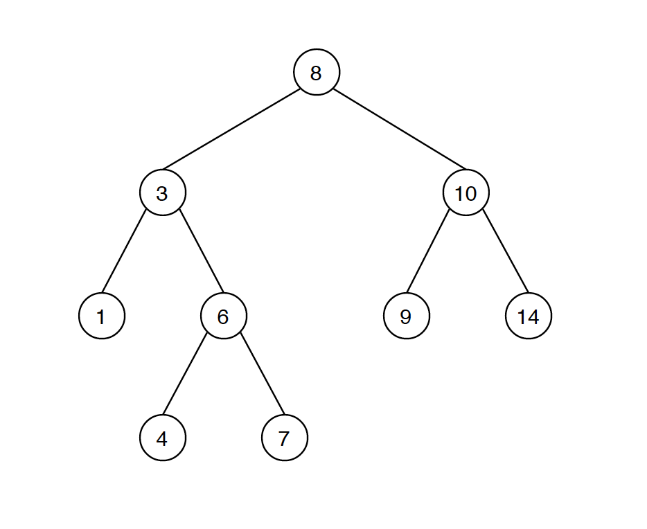
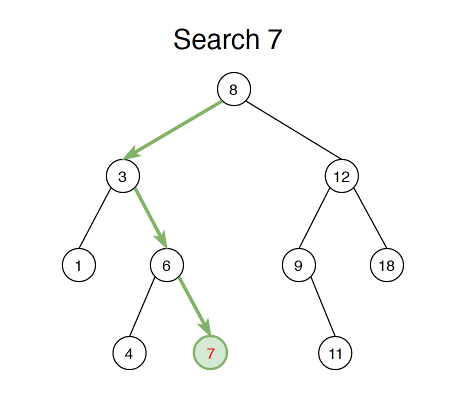
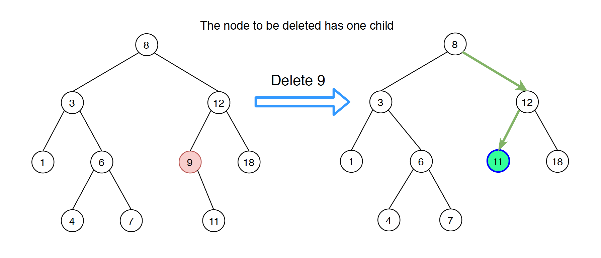
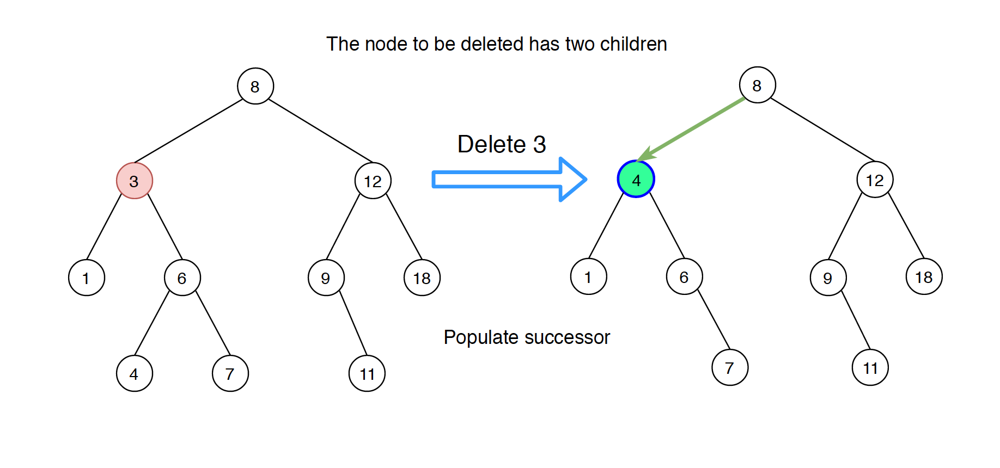
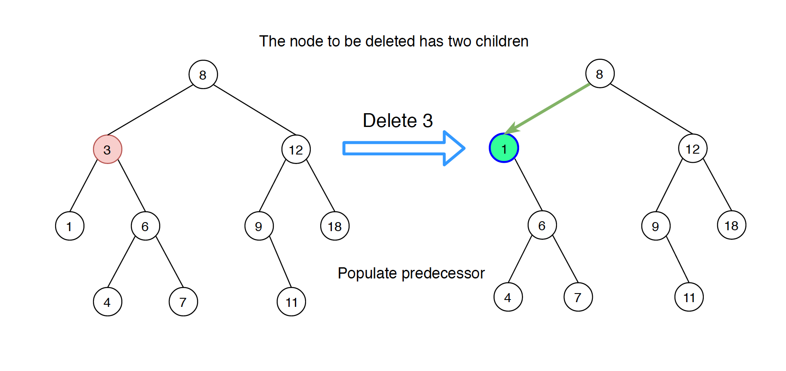
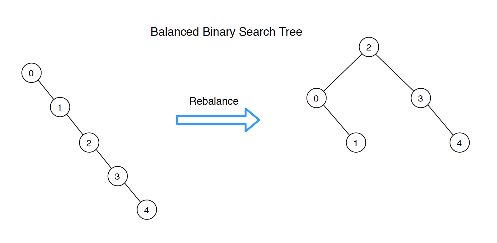

# Data Structure - Binary Search Tree

Implement and traverse binary search tree.

## Definition of BST

Binary Search Tree(BST) is a node-based binary tree data structure which has the following properties:

* The left subtree of a node contains only nodes with values lesser than the node’s value.
* The right subtree of a node contains only nodes with values greater than the node’s values.
* The left and right subtree each must also be a binary search tree.
* There must be no duplicate nodes.

{:width="450px"}  

## Common Operations on BST

* Search - $O(\log{}n)$
* Insertion - $O(\log{}n)$
* Deletion - $O(\log{}n)$

## Search

Given a binary search tree as follows, search node with value 7.

{:width="450px"}

Binary Search Tree is constructed with nodes recursively. The following example shows how the node is defined.

```java
public class BSTNode {
    public int val;
    public BSTNode left, right;

    public BSTNode(int value) {
        this.val = value;
    }
}
```

To search a given value in Binary Search Tree, we first compare it with root, if the key is present at root, we return root. If the value is greater than root’s value, we search further in the right subtree. Otherwise we search further in the left subtree.

```java
public boolean search(int val) {
    BSTNode current = root;
    while ( current != null) {
        if (current.val == val) {
            return true;
        } else if (current.val > val) {
            current = current.left;
        } else {
            current = current.right;
        }
    }
    return false;
}
```

## Insertion

Given a binary search tree as follows, insert new value 5 into this tree.


A new value is always inserted at leaf. Similar with the search operation, we start searching the given value from root till we hit a leaf node. Once a leaf node is found, the new node is added as a child of the leaf node. At each step, we compare the given value with the node value to determine whether to go left or right.

```java
public void insert(int val) {
    BSTNode newNode = new BSTNode(val);
    if (root == null) {
        root = newNode;
        return;
    }
    BSTNode current = root;
    while (true) {
        if (val < current.val) {
            if (current.left == null) {
                current.left = newNode;
                return;
            }
            current = current.left;
        } else {
            if (current.right == null) {
                current.right = newNode;
                return;
            }
            current = current.right;
        }
    }
}
```

## Deletion

There are three cases when deleting a node from Binary Search Tree.

* Node is leaf, has no children.
* Node has only one child.
* Node has two children.

### Node Has No Children


The solution is easy, simply remove the node from the tree.

### Node Has One Child



If node has only one child, then replace this node with its child.

### Node Has Two Children

This case is more complex, and we have two options.  

#### Populate successor



Find inorder successor of the node. Replace the node with its successor and delete the successor from its original parent.  

#### Populate predecessor  



Find inorder predecessor of the node. Replace the node with its predecessor and delete the predecessor from its original parent.  

The following implementation populates the successor of the deleted node.

```java
public boolean delete(int val) {
    deleteNode(root, val);
    return true;
}

// delete the node with the given key and return the root of the tree after deletion
private BSTNode deleteNode(BSTNode root, int key) {
    if (root == null) {
        return null;
    }
    if (key < root.val) {
        root.left = deleteNode(root.left, key);
    } else if (key > root.val) {
        root.right = deleteNode(root.right, key);
    } else {
        if (root.left == null) { // has no child, or left child is null
            return root.right;
        } else if (root.right == null) { // right child is null
            return root.left;
        }

        // has two children
        BSTNode minNode = findMin(root.right); // find min in right sub tree
        root.val = minNode.val; // use the min of right as the new root
        root.right = deleteNode(root.right, root.val); // delete the min in the original position
    }
    return root;
}

private BSTNode findMin(BSTNode node) {
    while (node.left != null) {
        node = node.left;
    }
    return node;
}
```

## Balanced Binary Search Tree

In some cases, we need to convert a normal BST tree to a balanced BST.

{:width="800px"}

We can convert it with the following two steps.

* Get the sorted node list from existing bst tree by traversing it inorder.
* Binary construct the balanced BST with the sorted node list.

```java
public BSTNode rebalanceBST(BSTNode root) {
    List<BSTNode> list = inorder(root);
    if (list == null || list.size() == 0) {
        return null;
    }

    return sortedListToBST(list, 0, list.size() - 1);
}

// build bst with give node list.
private BSTNode sortedListToBST(List<BSTNode> list, int start, int end) {
    if (start > end) {
        return null;
    }

    int mid = start + (end - start) / 2;
    BSTNode root = list.get(mid);

    root.left = sortedListToBST(list, start, mid - 1);
    root.right = sortedListToBST(list, mid + 1, end);
    return root;
}

// get the sorted node list of bst tree
public List<BSTNode> inorder(BSTNode root) {
    List<BSTNode> res = new ArrayList<BSTNode>();

    if (root == null) {
        return res;
    }

    List<BSTNode> left = inorder(root.left);
    List<BSTNode> right = inorder(root.right);

    res.addAll(left);
    res.add(root);
    res.addAll(right);

    return res;
}
```

## Binary Search Tree Iterator

```java
public class BSTIterator {
    private Stack<BSTNode> stack = new Stack<BSTNode>();
    private BSTNode curr;
    public BSTIterator(BSTNode root) {
        curr = root;
    }

    /** @return whether we have a next smallest number */
    public boolean hasNext() {
        return (curr != null || !stack.isEmpty());
    }

    /** @return the next smallest number */
    public int next() {
        while (curr != null) {
            stack.push(curr);
            curr = curr.left;
        }

        curr = stack.pop();
        int res = curr.val;
        curr = curr.right;
        return res;
    }
}
```

## Classic Problems

* [LeetCode 501 - Find Mode in Binary Search Tree](https://leetcode.com/problems/find-mode-in-binary-search-tree/)

## Source Files

* [Source files for Binary Search Tree on GitHub](https://github.com/jojozhuang/dsa-java/tree/master/ds-binary-search-tree)
* [Binary Search Tree Diagrams(draw.io) in Google Drive](https://drive.google.com/file/d/1tN8psEEeoMUMGsdppDaUnq0NRX4Y_ToG/view?usp=sharing)

## Reference

* [Binary Search Tree - Search and Insertion](https://www.geeksforgeeks.org/binary-search-tree-set-1-search-and-insertion/)
* [Binary Search Tree - Delete](https://www.geeksforgeeks.org/binary-search-tree-set-2-delete/)
* [Binary Search Tree Complete Implementation](https://algorithms.tutorialhorizon.com/binary-search-tree-complete-implementation/)
* [Sorted Array to Balanced BST](https://www.geeksforgeeks.org/sorted-array-to-balanced-bst/)
