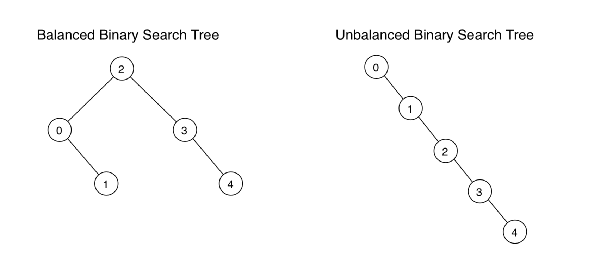
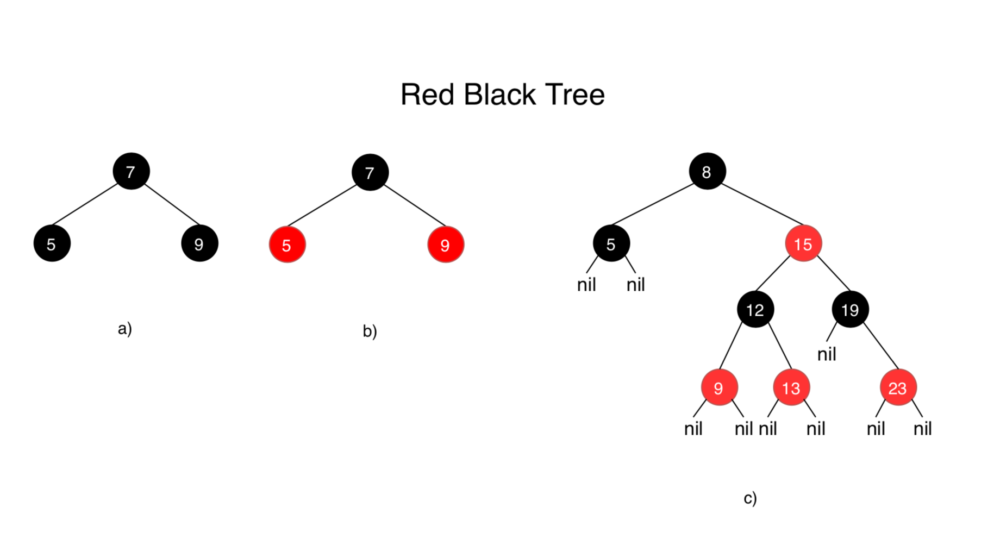
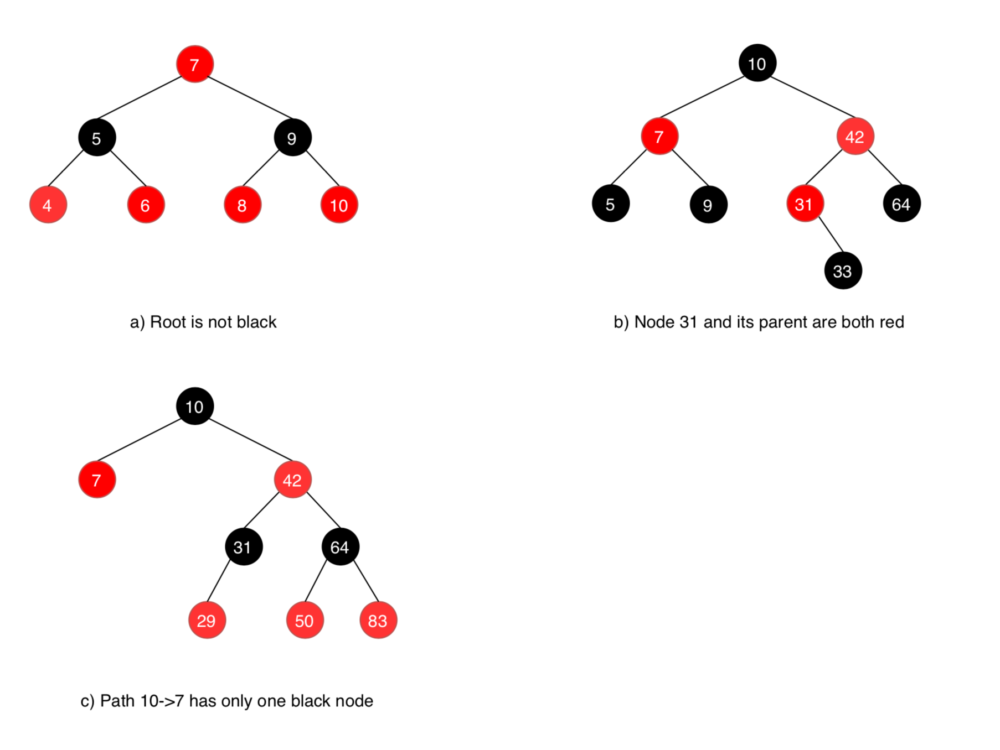
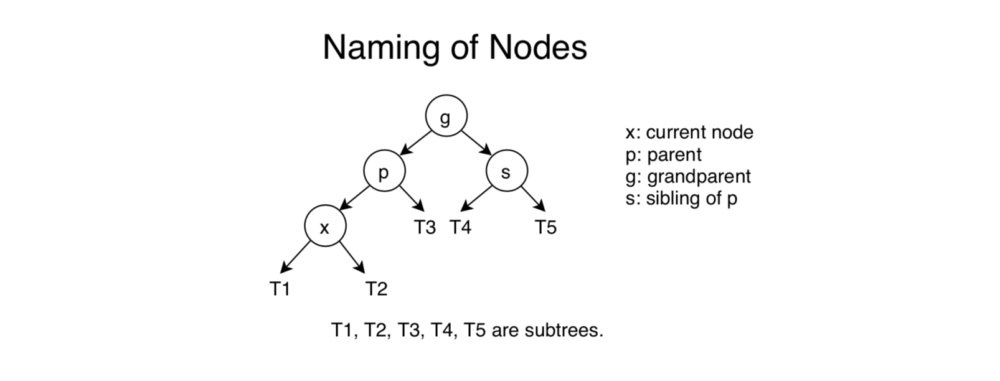
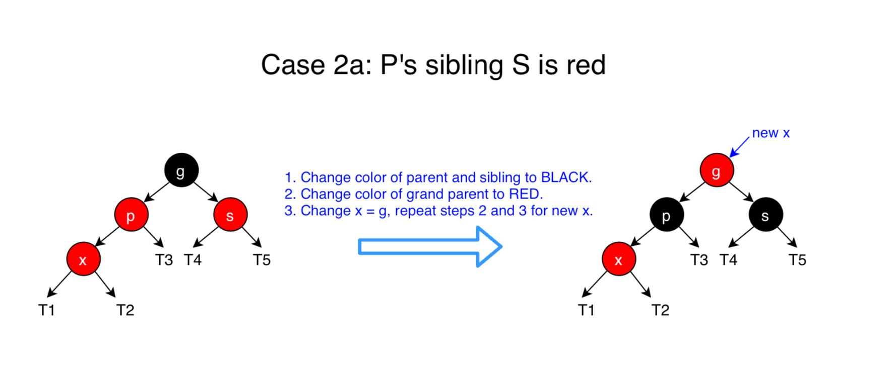
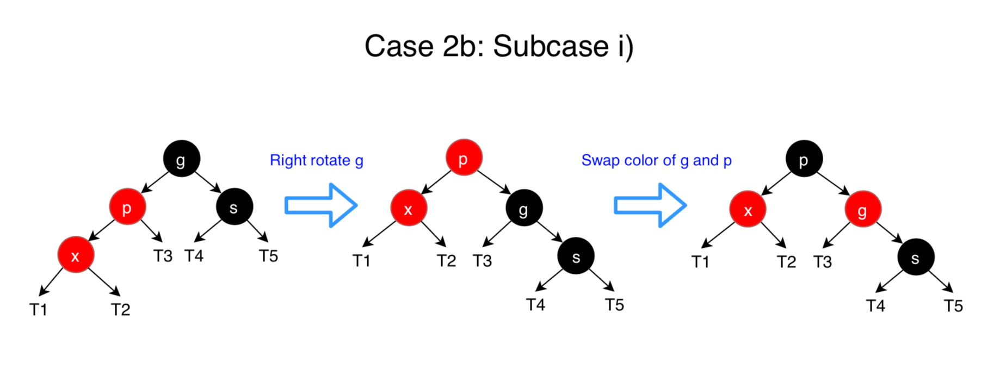
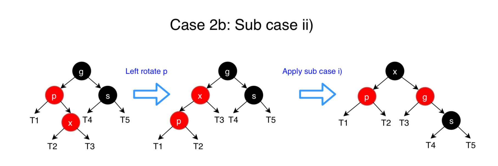
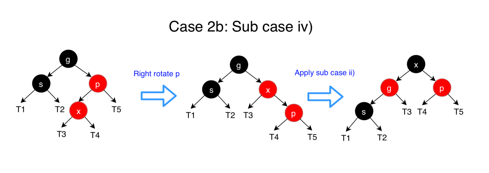
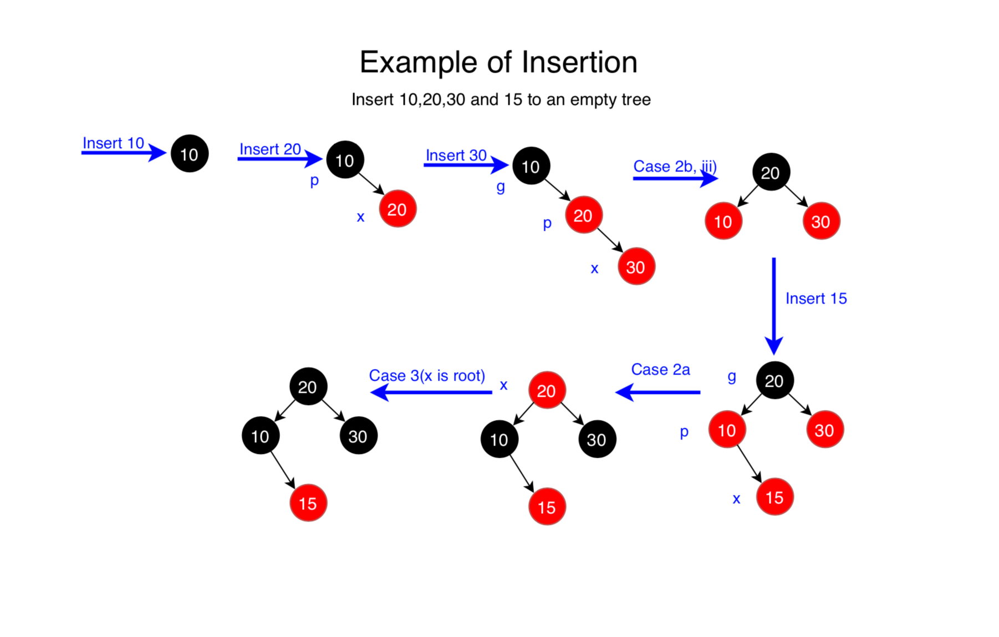

# Data Structure - Red Black Tree

Introduce red black tree and its properties.

## Problems with Binary Search Tree

For Binary Search Tree, although the average time complexity for the search, insertion and deletion are all $O(\log{}n)$, where **n** is the number of nodes in the tree, the time complexity becomes to $O(n)$ in worst case - BST is not balanced.
{:width="800px"}

We can guarantee $O(\log{}n)$ time for all three operations by using a balanced tree - a tree that always has height `log(n)`.

## Red Black Tree

### Definition of RBT

A red black tree is a binary search tree with following four properties.

* `Color property`: Each node has a color (red or black) associated with it (in addition to its key, left and right children).
* `Root property`: The root of the red-black tree is black.
* `Red property`: The children of a red node are black.
* `Black property`: For each node with at least one null child, the number of black nodes on the path from the root to the null child is the same.

Examples of Red Black Tree.

The following examples are **NOT** Red Black Tree.

### Time Complexity

* Search - $O(\log{}n)$
* Insertion - $O(\log{}n)$
* Deletion - $O(\log{}n)$

### Space Complexity

* $O(n)$

## Search

Same as [Binary Search Tree](/popular/datastructure/data-structure-binary-search-tree/#2-search).

## Insertion

The goal of the insert operation is to insert key `x` into tree `T`, and keep T's red-black tree properties. We use `Recoloring` and `Rotation` to achieve that.

There are several cases when inserting a new key to RBT. We will go through all of them below.

### Special Case: Empty Tree

A special case is required for an empty tree. If T is empty, replace it with a single black node containing x. This ensures that the root property is satisfied.
{:width="700px"}

### Non-empty Tree

If T is a non-empty tree, then we do the following:

* 1) Use the BST insert algorithm to add x to the tree
* 2) color the node containing x to red
* 3) restore red-black tree properties (if necessary)

For step 3, what we need to do depends on the color of x's parent. Let `p` be x's parent. We need to consider two cases:

* **Case 1**: x's parent p is **black**. The insertion of x does not result in the red property being violated, so there's nothing more to do.
* **Case 2**: K's parent p is **red**.  
For easy understanding, we have the following naming convention.
{:width="700px"}
If `p` is red, then p now has a red child, which violates the red property. Note that p's parent, `g`, must be black. In order to handle this double-red situation, we will need to consider the color of g's other child, that is, p's sibling, `s`. (Note that s might be null, i.e., g only has one child and that child is p.) We have two cases:
  * **Case 2a**: `p`'s sibling `s` is **red**.  
    Perform recoloring of `p`, `s` and `g`: the color of `p` and `s` is changed to **black** and the color of `g` is changed to **red** (unless `g` is the root, in which case we leave `g` **black** to preserve the root property).
    {:width="900px"}
    Recoloring does not affect the black property of a tree: the number of black nodes on any path that goes through `p` and `g` is unchanged when `p` and `g` switch colors (similarly for `s` and `g`). But, the recoloring may have introduced a double-red situation between `g` and `g`'s parent. If that is the case, then we `recursively` handle the double-red situation starting at `g` and `g`'s parent (instead of `x` and `x`'s parent).
  * **Case 2b**: `p`'s sibling `s` is **black** or **null**.  
    If `s` is black or null, then we will do a tri-node restructuring of `x`, `p` and `g`. There are four subcases for the relative ordering of x, p and g. The way a restructuring is done for each of the possibilities is shown below.
    * i) Left Left Case (p is left child of g and x is left child of p)
    {:width="900px"}
    * ii) Left Right Case (p is left child of g and x is right child of p)
    {:width="900px"}
    * iii) Right Right Case (Mirror of case i)
    {:width="900px"}
    * iv) Right Left Case (Mirror of case ii)
    {:width="900px"}

### Example of Insertion

## Deletion

There are three cases when deleting a node from Binary Search Tree.

* Node is leaf, has no children.
* Node has only one child.
* Node has two children.

## Source Files

* [Source files for Red Black Tree on GitHub](https://github.com/jojozhuang/dsa-java/tree/master/ds-red-black-tree)
* [Red Black Tree Diagrams(draw.io) in Google Drive](https://drive.google.com/file/d/1YKBH9VD-vg7LqoYj77tjU6sEQ64y9StE/view?usp=sharing)

## Reference

* [Red-Black Trees](http://pages.cs.wisc.edu/~skrentny/cs367-common/readings/Red-Black-Trees/)
* [Red-Black Tree - Set 1 (Introduction)](https://www.geeksforgeeks.org/red-black-tree-set-1-introduction-2/)
* [Red-Black Tree - Set 2 (Insert)](https://www.geeksforgeeks.org/red-black-tree-set-2-insert/)
* [Red-Black Tree - Set 3 (Delete)](https://www.geeksforgeeks.org/red-black-tree-set-3-delete-2/)
* [Red-black trees in 4 minutes — The basics](https://www.youtube.com/watch?v=qvZGUFHWChY)
* [Red-Black Trees - Data Structures](https://www.youtube.com/watch?v=ZxCvM-9BaXE)
* [Insertion for Red-Black Trees](https://www.youtube.com/watch?v=JwgeECkckRo)
* [Red/Black Tree Visualization](https://www.cs.usfca.edu/~galles/visualization/RedBlack.html)
